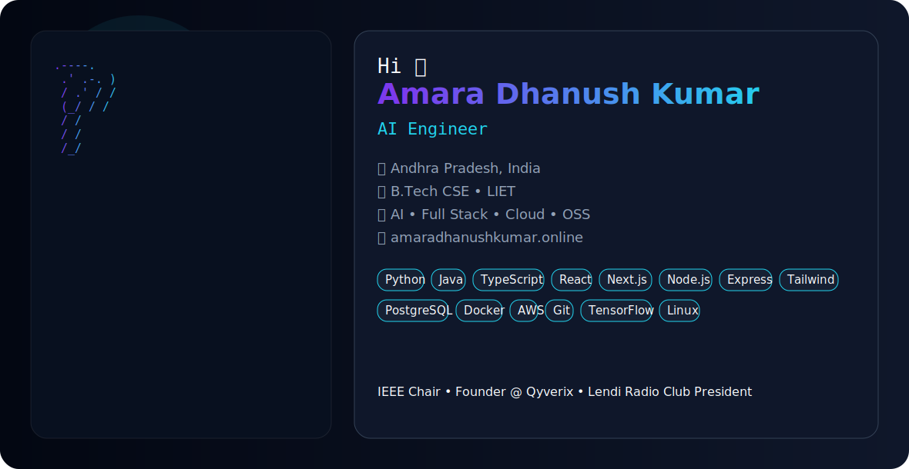

<div align="center">

<picture>
  <source media="(prefers-color-scheme: dark)" srcset="./dark.svg">
  <source media="(prefers-color-scheme: light)" srcset="./light.svg">
  
</picture>

# Hi 👋 I'm Amara Dhanush Kumar

### AI Engineer • Full Stack Developer • IEEE Student Branch Chair

[](https://amaradhanushkumar.online)
[](https://linkedin.com)
[](https://github.com)

</div>

---

## 🚀 About Me

```yaml
Name: Amara Dhanush Kumar

Location:
  Andhra Pradesh, India

Education:
  B.Tech Computer Science
  Lendi Institute of Engineering & Technology

Current Focus:
  - Artificial Intelligence
  - Full Stack Development
  - Cloud Infrastructure
  - Open Source

Leadership:
  - IEEE Student Branch Chair
  - President, Lendi Radio Club
  - Founder, Qyverix
```

---

## 🛠 Tech Stack

<p align="left">


</p>

---

## 📊 GitHub Stats

<p align="center">


</p>

---

## 🔥 GitHub Streak

<p align="center">


</p>

---

## 🏆 Achievements

- 🧠 AI Engineer
- 🚀 Founder — Qyverix
- 🎙 President — Lendi Radio Club
- 💡 IEEE Student Branch Chair
- 🌱 Open Source Enthusiast
- ⚡ Passionate about Developer Tools & Cloud

---

## 🌐 Connect

<p align="center">

<a href="https://amaradhanushkumar.online">

</a>

<a href="https://linkedin.com">

</a>

<a href="https://github.com/YOUR_GITHUB_USERNAME">

</a>

</p>

---

<div align="center">

*"Building intelligent systems, scalable applications, and meaningful communities."*

</div>
