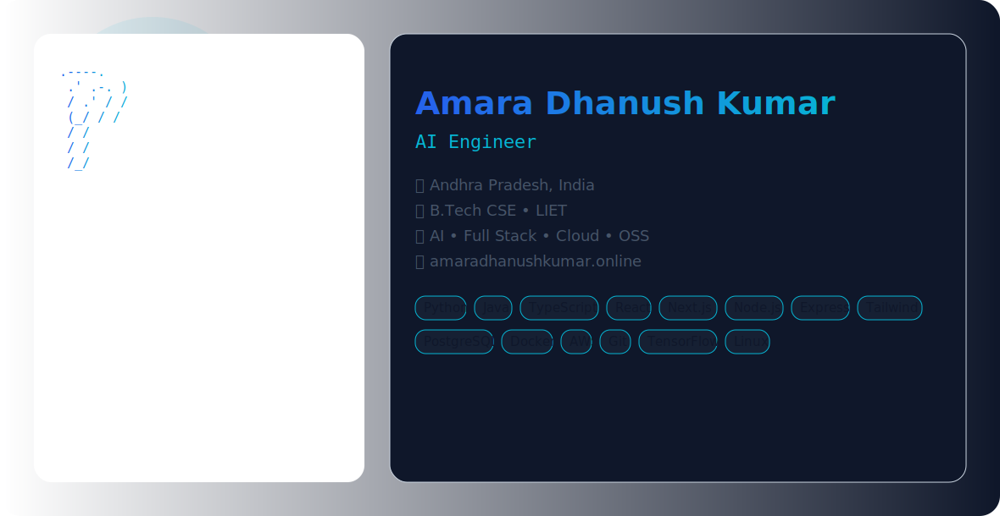

  <picture>
    <source media="(prefers-color-scheme: dark)" srcset="dark.svg">
    <source media="(prefers-color-scheme: light)" srcset="light.svg">
    
  </picture>

  <h1>Amara Dhanush Kumar</h1>

  

    <strong>AI Engineer</strong> &nbsp;•&nbsp; <strong>Full Stack Developer</strong> &nbsp;•&nbsp; <strong>Backend Engineer</strong> 
    <strong>Cloud Enthusiast</strong> &nbsp;•&nbsp; <strong>Open Source Contributor</strong>
  

  

    
    
    
    
    
  

  

    
    
    
    
  

---

##  About Me

I am a Computer Science student at **Lendi Institute of Engineering & Technology** in Andhra Pradesh, India. My public work focuses on practical, production-ready software—particularly API-driven microservice architectures, backend systems using core PHP, automation workflows, and applied AI.

Beyond writing code, I am deeply involved in campus technical and media leadership. My open-source repositories reflect a hands-on approach to engineering: building web platforms, management systems, and utility tools that solve real operational friction.

*    **Location:** Vizianagaram, Andhra Pradesh, India
*    **Education:** B.Tech Computer Science & Engineering
*    **Leadership:** IEEE Student Branch Chair | President, Lendi Radio Club | Founder, Qyverix

---

##  What I'm Doing Now

*    **Architecting Backends:** Designing API-driven microservice website architectures. I have a strong preference for writing highly optimized, core PHP without relying heavily on external frameworks.
*    **Deploying Systems:** Managing file hierarchies and deploying custom architectures across personal and college domains using Hostinger services.
*    **Fostering Community:** Directing technical initiatives, peer learning sessions, and hackathons as the IEEE Student Branch Chair.

---

##  Tech Stack

<strong>Languages</strong>

  

<strong>Frameworks</strong>

  

<strong>Databases</strong>

  

<strong>Tools & Platforms</strong>

  

---

##  Featured Projects

### Web & Backend Systems
*   **[SDMS](https://github.com/dhanush-the-versatile/sdms):** A robust PHP-based Skill Development Management System featuring role-based dashboards (student, faculty, HOD, admin), approval flows, notifications, and automated letter generation. *(PHP, MySQL, TCPDF)*
*   **[JatayuNetra](https://github.com/dhanush-the-versatile/JatayuNetra):** A Smart Tourist Safety System integrating geo-awareness, automated Twilio communications, and robust database capabilities for emergency response. *(PHP, JS, HTML/CSS)*
*   **[Shop_DBMS](https://github.com/dhanush-the-versatile/Shop_DBMS):** A full web app version of a Grocery Store Management system handling inventory, billing, returns, and reports. *(JS, HTML, CSS)*
*   **[ETF_project](https://github.com/dhanush-the-versatile/ETF_project):** A multi-page, content-driven academic platform built for the English Teachers Forum Bharath. *(HTML, CSS, JS)*

### Software Utilities & Prototypes
*   **[PDF_merger](https://github.com/dhanush-the-versatile/PDF_merger):** A Python desktop utility for merging files, inserting filenames into PDFs, and choosing text positioning—built for offline Windows use. *(Python, Tkinter, PyPDF2)*
*   **[DistributedVotingSystem](https://github.com/dhanush-the-versatile/DistributedVotingSystem_master):** Prototype-ready Java project for a distributed, systems-oriented voting platform. *(Java)*

---

##  Experience & Milestones

*   **Founder, Qyverix:** Building a founder mindset around practical engineering, applied AI, and product thinking.
*   **Intern, Marquee Equity:** Gained professional exposure and industry experience in early 2025.
*   **Onsite Operations Team, eInkPrint:** Managed technical onsite operations for eInkPrint at the Mega Trade Fair.
*   **Award Winner:** Secured 1st prize in project presentation at SSC-2025 (organized by the IEEE Vizag Bay Section) and runner-up in college-level poster presentation competitions.
*   **NPTEL Certifications:** Completed two rigorous NPTEL platform certifications with the highest grades.

---

##  Beyond Code: Communication & Media

Engineering isn't just about code; it's about communication. As the **Student Elected President of the Lendi Radio Club**, I've honed my public speaking and media management skills:
*   Hosted a continuous **12-hour radio broadcast** without leaving the booth.
*   Hosted **22 individual shows** in a single month to drive campus engagement.
*   Conducted interviews with notable figures, including Gampa Nageshwar Rao.
*   Managed end-to-end radio promotions, technical setups, and "Tech Talk Tuesday" presentations.

---

##  GitHub Analytics

  
  

  

  

---

##  Connect With Me

  
  
  
  
  

 

  
  
<em>Building intelligent systems, scalable applications, and meaningful communities.</em>

